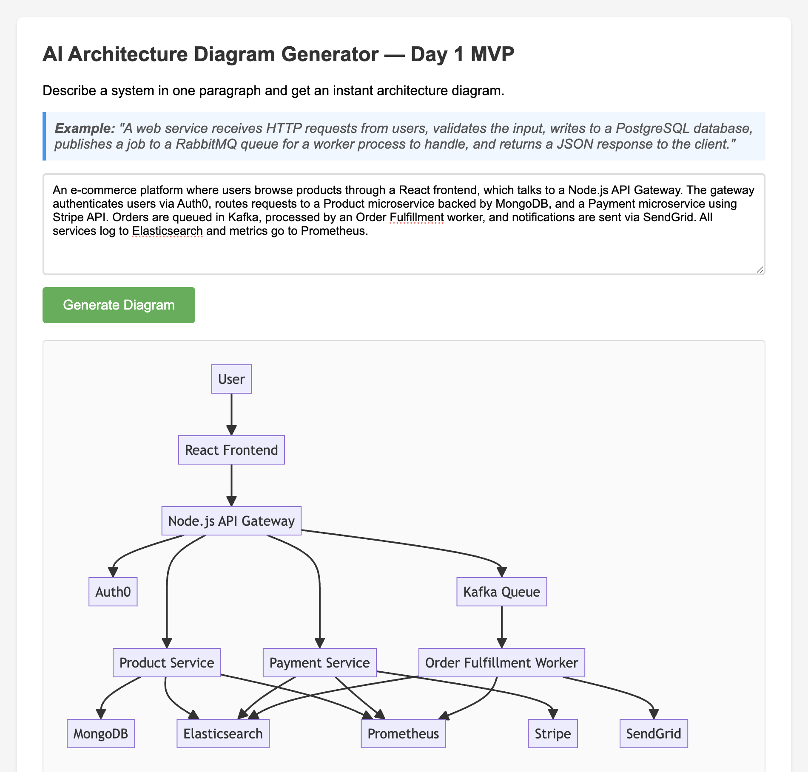

# AI Architecture Diagram Generator

**Turn text descriptions into beautiful architecture diagrams instantly.**

🔗 **[View Landing Page](https://cherry-saver-91d.notion.site/AI-Architecture-Diagram-Generator-64dedb8b0b48469ebd56ba520c7afd55)** | 🚀 **[Try Live Demo](https://saurabhs051.github.io/ai-architecture-diagram-generator)**

---

## What It Does

Describe any system architecture in plain English, and this tool uses AI to generate a clean, professional Mermaid diagram automatically. No drawing tools needed.

**Example Input:**
> "A web service receives HTTP requests from users, validates the input, writes to a PostgreSQL database, publishes a job to a RabbitMQ queue for a worker process to handle, and returns a JSON response to the client."

**Output:** A beautiful, auto-generated architecture diagram showing all components and their relationships.

---

## Demo



---

## Features

- ✅ **Instant Demo Examples** - Try 4 pre-built examples with zero setup
- ✅ **AI-Powered** - Uses Claude 3.5 Sonnet, GPT-4o-mini, or Llama 3.1
- ✅ **Bring Your Own Key** - Use your free API credits, no cost to us or you
- ✅ **Privacy First** - API keys stored locally in browser only
- ✅ **Multiple Providers** - Works with Groq (free!), OpenRouter, or OpenAI
- ✅ **Client-Side Processing** - Direct API calls, no backend needed
- ✅ **Instant Results** - Generate diagrams in 5-10 seconds
- ✅ **Clean Modern UI** - Professional, responsive design
- ✅ **Mermaid Rendering** - Beautiful, professional-quality diagrams

---

## Quick Start

### Option 1: Use Online (Instant!)

**🎯 Try it now:** [https://saurabhs051.github.io/ai-architecture-diagram-generator](https://saurabhs051.github.io/ai-architecture-diagram-generator)

1. **Try demo examples** - Click any example to see instant diagrams
2. **Generate your own** - Add your free API key to create custom diagrams

**Get a free API key:**
- **[Groq](https://console.groq.com)** - Free, fast, recommended! ⚡
- **[OpenRouter](https://openrouter.ai)** - $0.10 free credits
- **[OpenAI](https://platform.openai.com)** - $5 free credits

Your API key is stored only in your browser and never sent to our servers.

---

### Option 2: Run Locally (For Development)

### 1. Clone the repo
```bash
git clone https://github.com/saurabhs051/ai-architecture-diagram-generator.git
cd ai-architecture-diagram-generator
```

### 2. Install dependencies
```bash
npm install
```

### 3. Set up your API key
Create a `.env` file:
```bash
# Option 1: OpenRouter (recommended - access to multiple models)
OPENROUTER_API_KEY=your_key_here

# Option 2: OpenAI
OPENAI_API_KEY=your_key_here

# Option 3: Groq
GROQ_API_KEY=your_key_here
```

### 4. Run the server
```bash
npm start
```

### 5. Open your browser
Visit `http://localhost:3000` and start generating diagrams!

**Note:** The local server is for development. For production use, the GitHub Pages version is recommended (users bring their own API keys).

---

## How It Works

### The Hybrid Approach

This tool offers the best of both worlds:

1. **🎬 Instant Demo Examples** - Click and see pre-generated diagrams immediately (no API key needed)
2. **🔑 Bring Your Own Key (BYOK)** - Add your free API key to generate unlimited custom diagrams

### Why BYOK?

- ✅ **Zero Cost to You** - Use your own free-tier API credits
- ✅ **Privacy First** - Your API key never leaves your browser
- ✅ **Unlimited Use** - Generate as many diagrams as you want
- ✅ **No Rate Limits** - We don't track or limit your usage

### The Process

1. **User Input** - Describe your system in plain text
2. **AI Processing** - LLM (running on Groq/OpenRouter/OpenAI) converts description to Mermaid syntax
3. **Client-Side Rendering** - Mermaid.js renders the final diagram in your browser
4. **Display** - Beautiful architecture diagram appears instantly

All API calls go directly from your browser to the AI provider - we never see your key or your data!

---

## API Support

This tool works with multiple AI providers:

- **OpenRouter** (recommended) - Access to Claude 3.5 Sonnet, GPT-4, and more
- **OpenAI** - GPT-4o-mini by default
- **Groq** - Fast inference with Llama 3.1 70B

Simply add the appropriate API key to your `.env` file.

---

## Tech Stack

- **Backend:** Node.js + Express
- **Frontend:** Vanilla HTML/CSS/JS
- **Diagram Rendering:** Mermaid.js
- **AI:** OpenRouter / OpenAI / Groq

---

## Project Structure

```
ai-architecture-diagram-generator/
├── server.js         # Express backend with AI integration
├── index.html        # Frontend UI
├── package.json      # Dependencies
└── .env             # API keys (not committed)
```

---

## Contributing

Found a bug or want to add a feature? PRs are welcome!

1. Fork the repo
2. Create your feature branch (`git checkout -b feature/amazing-feature`)
3. Commit your changes (`git commit -m 'Add amazing feature'`)
4. Push to the branch (`git push origin feature/amazing-feature`)
5. Open a Pull Request

---

## License

MIT License - feel free to use this for your own projects!

---

## Acknowledgments

Built with ❤️ by [Saurabh Singh](https://www.linkedin.com/in/saurabh-singh-822b66125/) (Software Engineer @ Adobe) as a Day 1 MVP to demonstrate the power of AI + simple web tech.

**Connect:** [LinkedIn](https://www.linkedin.com/in/saurabh-singh-822b66125/) • [Twitter/X](https://x.com/sysdesign_ai) • [GitHub](https://github.com/saurabhs051)

**Questions?** Open an issue or reach out!

---

## Get Updates

Want early access to premium features (PNG/SVG export, templates, advanced layouts)?

**[⚡ Join the Early Access Waitlist](https://sysdesign.kit.com/ai-arch-early-access)**

Or follow along: [Twitter/X](https://x.com/sysdesign_ai) • [LinkedIn](https://www.linkedin.com/in/saurabh-singh-822b66125/) • [GitHub](https://github.com/saurabhs051)

